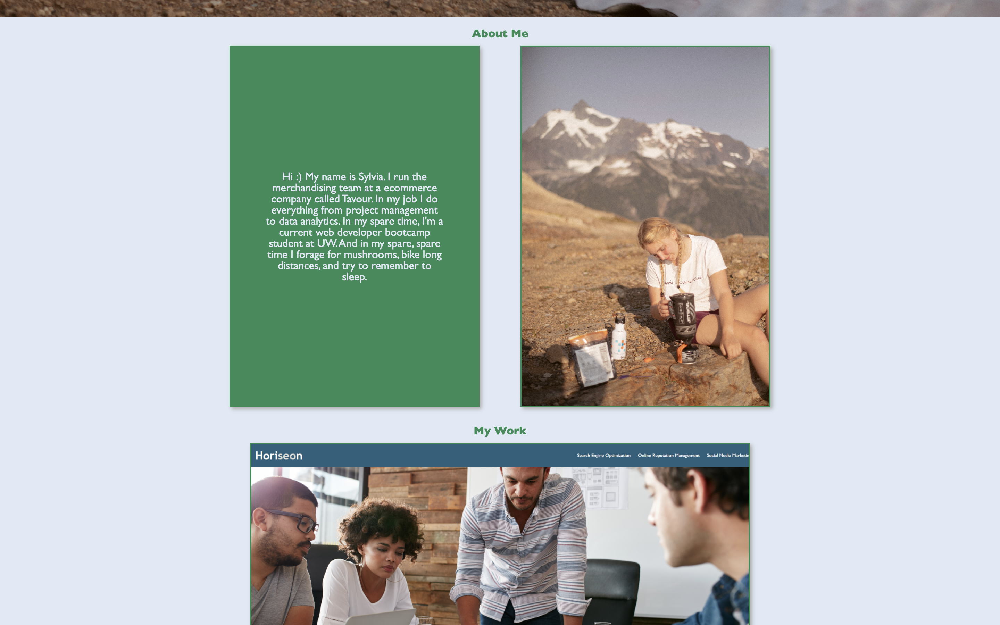
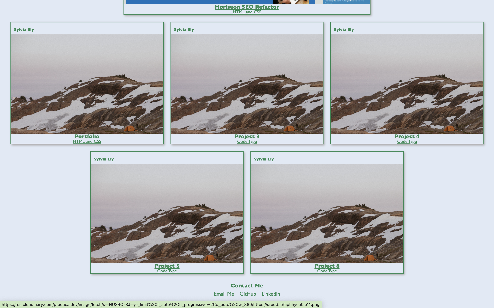

# Developer-Portfolio
My portfolio showcases all of the rad projects I have worked on!

## Description
In this project, I have created my own developer portfolio that I will keep adding to and improving throughout my course.
This portfolio includes a small background on me, the projects that I have worked on, as well as how to contact me.  

## Installation
NA

## Usage
My future employer will be able to view sampled of my projects so that they can determine why I'm a good candidate for a job.  

## Credits
NA

## License

Please refer to the LICENSE in the repo.

## Screenshots

## Link to Deployed Website
[Link](https://sely1724.github.io/semantic-structures/)

